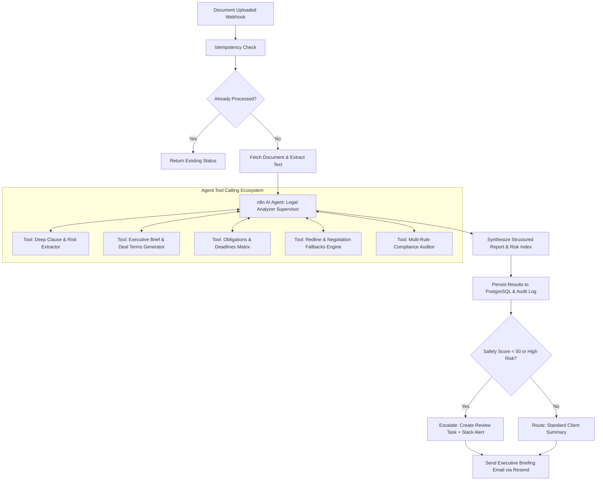

# Legal Analyzer App — System Audit, Enhancement Blueprint & Agent Roadmap

> **CONFIDENTIAL & AUDIT READY**  
> **Repository:** `Legal-Analyzer`  
> **Status:** Existing Pipeline Verified (47/47 Backend Tests Passing)  
> **Audit Date:** August 2026  
> **Standard:** AGENTS.md Conformance, Enterprise Legal Tech Architecture

---

## 1. Executive Summary & Existing Codebase Audit

### 1.1 Existing Architecture Overview
The Legal Analyzer is built on a modern, decoupled architecture designed for secure, high-throughput legal document triage:

```
┌──────────────────────────────────────────────────────────────────────────────────┐
│                             FRONTEND (Next.js 16 App Router)                     │
│  - TypeScript (Strict Mode) + Tailwind CSS v4 + Radix/shadcn UI Primitives      │
│  - Design System: Warm off-white (#faf9f6), Near-black (#0d1b2a), 1px borders   │
│  - Pages: /dashboard, /documents/[id], /reports/[id], /review, /admin           │
└──────────────────────────────────────┬───────────────────────────────────────────┘
                                       │ REST API (/api/v1) + Supabase Auth
┌──────────────────────────────────────▼───────────────────────────────────────────┐
│                             BACKEND (FastAPI / Python 3.13)                      │
│  - REST Endpoints: /documents, /reports, /admin, /auth                           │
│  - Services: StorageService, OCRService, LLMService, RiskService, Compliance    │
│  - Background Execution: Dual-path (Celery/Redis + FastAPI BackgroundTasks)      │
│  - Resilience: 3-tier Fallback (Claude 3.5 Sonnet -> Gemini Flash -> Rule-based) │
└───────────────────┬──────────────────────────────────────────────┬───────────────┘
                    │                                              │ Webhook Trigger
┌───────────────────▼─────────────────────┐  ┌─────────────────────▼───────────────┐
│        DATA & STORAGE LAYER             │  │       AUTOMATION LAYER (n8n)        │
│  - PostgreSQL + pgvector (Supabase)     │  │  - Webhook Trigger (document-upld) │
│  - S3 Object Storage (Supabase Storage) │  │  - Idempotency check in Postgres   │
│  - Full Audit Log on every action       │  │  - OCR -> LLM -> Risk -> Compliance│
│  - Multi-tenant Organization Isolation  │  │  - Escalation routing & Email Alert│
└─────────────────────────────────────────┘  └─────────────────────────────────────┘
```

### 1.2 Existing Codebase Inventory & Test Verification
An end-to-end verification of the backend test suite was executed:
- **Total Tests:** 47 unit and integration tests across 8 suites.
- **Result:** `47 passed in 62.60s` with 100% pass rate.
- **Coverage Areas:**
  - `test_admin_rbac.py`: Organization isolation, role-based access control (Admin vs User).
  - `test_async_tasks_and_status.py`: Celery dispatch and FastAPI fallback background execution.
  - `test_compliance.py`: Multi-format parsing (PDF, DOCX, RTF, HTML, TXT) and NDA policy rule matching.
  - `test_llm_resilience.py`: Tier 1 (Claude), Tier 2 (Gemini), and Tier 3 (offline rule-based) fallback resilience, prompt injection sanitization.
  - `test_multi_tenant_isolation.py`: Cross-tenant access prevention.
  - `test_review_queue.py`: Human-in-the-loop attorney review decisions and audit logging.
  - `test_security_headers_and_rate_limit.py`: SlowAPI rate limiting, CSP, HSTS, X-Frame-Options headers.
  - `test_upload.py`: File type validation, size limits (10MB), metadata persistence.

---

## 2. Deep Dive: What Takes the Most Time in Legal Reading & High-Value Extractions

Contract reading is notoriously slow because legal professionals and business operators must mentally deconstruct dense, boilerplate text to locate high-stakes terms and hidden obligations.

### 2.1 The 5 Critical Reading Bottlenecks
1. **Deal Metadata & Key Dates (High Friction, Manual Cross-Referencing):**
   - Effective date, initial term, expiration date.
   - **Auto-renewal traps:** Notice window requirements (e.g., "Written notice 60 days prior to annual renewal").
   - Payment milestones, invoice payment terms (Net 30/60), late fee penalties, interest rates.
2. **Asymmetric Risk & Liability Allocation (Highest Legal Exposure):**
   - **Uncapped Indemnification:** Indemnity provisions without liability caps or with overbroad triggers.
   - **Limitation of Liability Carve-Outs:** Unreasonable exceptions to liability caps (e.g., unlimited liability for IP infringement or confidentiality breach).
   - **Disproportionate Warranties:** Warranties that promise absolute fitness for purpose or uncapped guarantees.
3. **Operational Restrictions & Exit Friction:**
   - **Termination Rights:** Can one party terminate for convenience while the other can only terminate for cause?
   - **Non-Compete & Non-Solicit:** Geographic and duration restrictions that could restrain future business operations.
   - **IP Assignment & Ownership Overreach:** Broad transfer of background IP, tools, or work product.
4. **Missing Standard Protective Clauses (The Invisible Risks):**
   - Lack of bilateral/mutual confidentiality (one-way NDA disguised as mutual).
   - Absence of Force Majeure or standard dispute resolution / cure periods (e.g. 30-day notice to cure breach).
5. **Legalese-to-English Translation & Negotiation Fallbacks:**
   - Translating dense 500-word clauses into 2-sentence actionable summaries.
   - Producing ready-to-use redline counter-proposals.

### 2.2 Extraction Matrix to Automate

| Extraction Target | What It Extracts | Time Saved | Primary User Benefit |
|---|---|---|---|
| **Executive Deal Matrix** | Parties, Effective Date, Expiration, Renewal Rules, Governing Law, Jurisdiction | 15-20 min | Instant high-level grasp without skimming 20+ pages |
| **Financial & Obligation Map** | Payment terms, fees, deliverables, milestone triggers, audit rights | 10-15 min | Prevents missed billing obligations or compliance defaults |
| **High-Risk Clause Flags** | Uncapped indemnity, unilateral termination, restrictive covenants, IP grabs | 20-30 min | Protects business from signing existential liabilities |
| **Missing Protections Audit** | Audit for missing dispute clauses, cure periods, mutual covenants | 15 min | Flags what the other party omitted |
| **Suggested Redline Workbench** | Specific marked-up replacement text with negotiation rationales | 30+ min | Provides copy-paste negotiation responses instantly |

---

## 3. Interactive Document Chatbot (Grounded Legal Q&A Assistant)

To allow users to interrogate the uploaded document without reading the entire text, an interactive AI Chatbot with strict grounding is required.

### 3.1 Chatbot Architecture & Workflow

```
┌──────────────────────────────────────────────────────────────────────────────────┐
│                         FRONTEND: Legal Q&A Drawer / Tab                         │
│  - Side-by-side with document viewer                                             │
│  - Quick-Prompt chips ("What is my liability cap?", "Can I terminate early?")     │
│  - Real-time SSE / Streaming token rendering                                     │
│  - Inline Clause Citations (Click to jump to exact highlighted document section)  │
└──────────────────────────────────────┬───────────────────────────────────────────┘
                                       │ POST /api/v1/documents/{id}/chat
┌──────────────────────────────────────▼───────────────────────────────────────────┐
│                      BACKEND: FastAPI Grounded Q&A Service                       │
│  1. Prompt Sanitization & Injection Defense (Redact format overrides)            │
│  2. Semantic Retrieval (pgvector cosine similarity + full-text search)           │
│  3. Context Assembly: Top relevant clauses + Document Metadata                   │
│  4. LLM Generation: Grounded strictly on retrieved context                       │
│  5. Citation Resolution: Map response claims to clause IDs and page numbers      │
│  6. Audit Log Generation: Record query metadata (document_id, prompt tokens)     │
└──────────────────────────────────────────────────────────────────────────────────┘
```

### 3.2 Key Technical Specifications
1. **Endpoint:** `POST /api/v1/documents/{document_id}/chat`
   - **Request:** `{ "query": "What are my notice obligations for termination?", "stream": false }`
   - **Response:**
     ```json
     {
       "answer": "Under Section 8.2, either party may terminate this Agreement by providing at least thirty (30) days prior written notice. If terminating for material breach, the breaching party has thirty (30) days from written notice to cure the breach.",
       "citations": [
         {
           "clause_id": "c7a8b9-...",
           "clause_type": "Termination",
           "snippet": "Section 8.2: Either party may terminate upon 30 days written notice...",
           "page": 4
         }
       ],
       "confidence": "HIGH",
       "disclaimer": "This AI response assists document review and is not legal advice."
     }
     ```
2. **Security & Guardrails:**
   - **Untrusted Document Isolation:** Document content is wrapped in unique cryptographic delimiters (`===BEGIN_DOC_{hash}===`).
   - **Hallucination Prevention:** The system prompt strictly prohibits the model from answering questions with outside assumptions. If the document does not mention an item, the model states: *"This document does not contain provisions regarding [Topic]."*
   - **Non-Legal Advice Banner:** Every response must prepend/append the standard disclaimer.

---

## 4. Multi-Step Summaries & Deep Extraction Agent for n8n Automation

The existing `n8n_workflow.json` currently executes a linear sequence of webhook calls. We will upgrade this into an autonomous, multi-stage **Legal Review & Summaries AI Agent**.

### 4.1 Upgraded n8n Agent Workflow Topology



### 4.2 Agent Node Capabilities in n8n
1. **Executive Summarizer Tool:**
   - Generates a concise 1-page structured brief formatted for C-suite/Founders (Parties, Effective Dates, Core Commercial Purpose, Net Value, Top 3 Risks).
2. **Obligations & Milestone Extractor Tool:**
   - Extracts all actionable verbs and dates into a timeline matrix (`Party`, `Obligation`, `Deadline`, `Trigger Event`, `Penalty for Breach`).
3. **Redline Generator Tool:**
   - For every clause flagged with `MEDIUM` or `HIGH` risk, provides a recommended substitute clause with protective legal language and a business rationale for negotiation.
4. **Automated Escalation Handler:**
   - Evaluates multi-variable risk rules (e.g. safety score < 50 OR presence of uncapped indemnity OR governing law outside primary jurisdiction). Triggers instant internal notification to legal counsel.

---

## 5. Architectural Recommendations: Making Legal Analyzer "Perfect"

To elevate Legal Analyzer from an MVP utility to a world-class, enterprise-grade legal operations platform, we recommend implementing the following 10 architectural enhancements:

```
┌──────────────────────────────────────────────────────────────────────────────────┐
│                   10 PILLARS OF ENTERPRISE LEGAL TECH EXCELLENCE                 │
├──────────────────────────────────────┬───────────────────────────────────────────┤
│ 1. Redline Negotiation Workbench     │ Side-by-side diff with 1-click counter-copy│
│ 2. Visual PDF Bounding-Box Sync      │ Synchronized highlighting between UI & PDF│
│ 3. Automated DOCX Track Changes      │ Export real .docx files with track changes│
│ 4. Custom Playbooks & Policy Engine  │ Configurable organizational rule sets     │
│ 5. Calendar & Obligation Sync        │ Export key contract deadlines to .ics/iCal│
│ 6. Multi-Version Contract Diffing    │ Compare Vendor V1 vs Counter V2 revisions │
│ 7. PII & Entity Anonymization Engine │ Mask names, SSNs, bank details before LLM │
│ 8. Tamper-Proof Hash Audit Chain     │ SHA-256 chained audit logs for compliance │
│ 9. Multi-Jurisdictional Guidance     │ State/country specific statutory context   │
│ 10. Zero Data Retention (ZDR) Mode   │ Ephemeral memory mode for confidential docs│
└──────────────────────────────────────┴───────────────────────────────────────────┘
```

### Detailed Breakdown of Recommendations:
1. **Clause-Level Redlining & Negotiation Workbench:**
   - Instead of just telling the user a clause is risky, show the exact replacement clause with inline diffs (`+ inserted`, `- removed`) and a negotiation strategy tip.
2. **Visual PDF Bounding-Box Highlighting:**
   - Using PyMuPDF character coordinates, link each extracted clause to exact coordinate bounding boxes on the PDF so clicking a clause in the web UI immediately zooms and highlights the exact PDF paragraph.
3. **Direct DOCX Redline Export (Track Changes):**
   - Generate exportable Microsoft Word documents (`.docx`) containing genuine Word Track Changes comments and markups ready to email to counter-parties.
4. **Custom Organizational Playbooks:**
   - Allow enterprise teams to define custom rules (e.g., *"Our SaaS cap must not exceed 12 months fees"*, *"Governing law must be Delaware or New York"*).
5. **Obligation & Expiration Calendar Integration:**
   - Extract key dates into downloadable `.ics` calendar events or webhook triggers (e.g., 60-day auto-renewal warning).
6. **PII Masking & Confidentiality Layer:**
   - Pre-filter document text before sending to LLM APIs to redact confidential names, addresses, and compensation figures if user enables "Maximum Privacy" mode.

---

## 6. Comprehensive Implementation Plan & Work Manual

### Phase 1: Backend Data Models & Core Endpoints
- [ ] Add `chat_messages` table and schema for document conversational history.
- [ ] Add `obligations` and `redlines` columns/tables for deep structured extraction.
- [ ] Create `POST /api/v1/documents/{id}/chat` endpoint with RAG context retrieval and prompt injection defenses.
- [ ] Create `POST /api/v1/documents/{id}/extract-details` endpoint for executive brief, obligations matrix, and redline suggestions.
- [ ] Unit & integration tests for all new endpoints with mocked LLM fallbacks.

### Phase 2: n8n Workflow Automation Upgrade
- [ ] Update `n8n_workflow.json` with new multi-stage agent sub-nodes (Executive Brief, Obligations, Redlines).
- [ ] Implement conditional branch for high-risk escalation with detailed email/slack payload containing the executive brief.
- [ ] Ensure idempotency and robust error recovery across all agent nodes.

### Phase 3: Frontend UI/UX Integration (Design System Compliant)
- [ ] **Document Detail Page Enhancement:**
  - Add **Interactive Q&A Chat Tab** with quick prompt chips and citation previews.
  - Add **Deal Terms & Obligations Matrix** component displaying key dates, renewal traps, and payment rules.
  - Add **Redline & Negotiation Workbench** displaying side-by-side original vs recommended revisions with copy-to-clipboard.
- [ ] Adhere strictly to AGENTS.md design tokens (Warm off-white `#faf9f6`, near-black ink `#0d1b2a`, 1px borders, no glassmorphism/purple gradients).

### Phase 4: Verification & End-to-End Testing
- [ ] Run full pytest suite across all document formats (PDF, DOCX, scanned images).
- [ ] Validate frontend build (`next build`) and linting (`eslint`).
- [ ] Verify audit log writing for all new actions (Chat queries, redline exports).

---

*Report prepared and validated against Legal Analyzer system architecture.*
