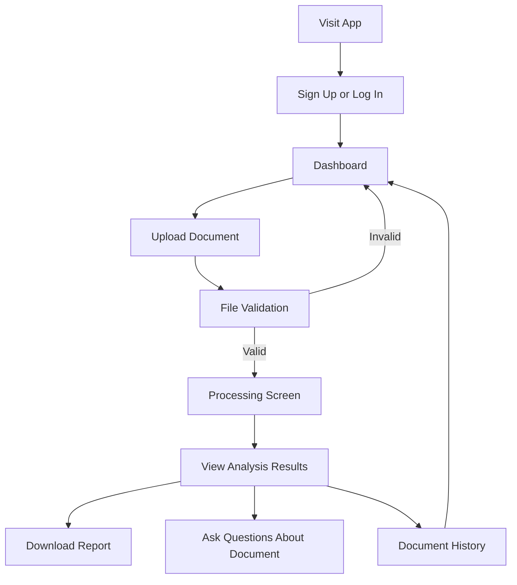
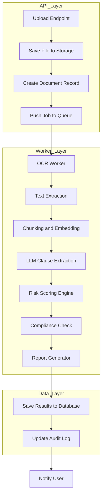
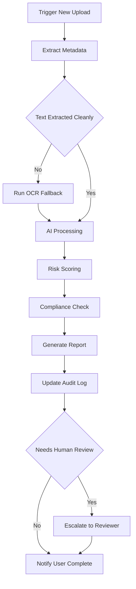
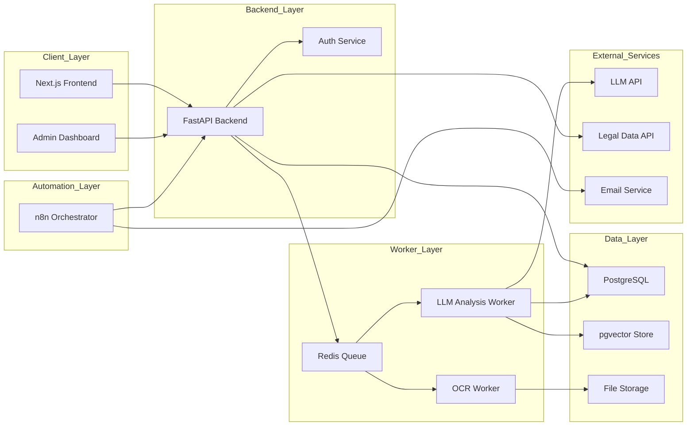
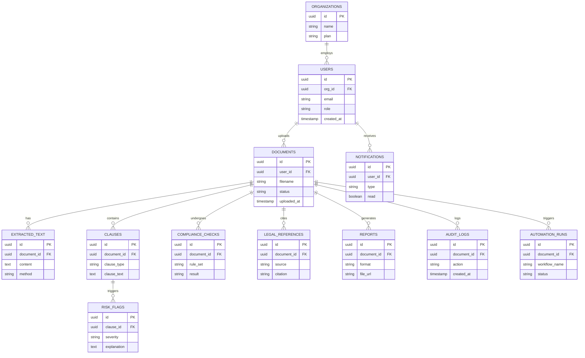
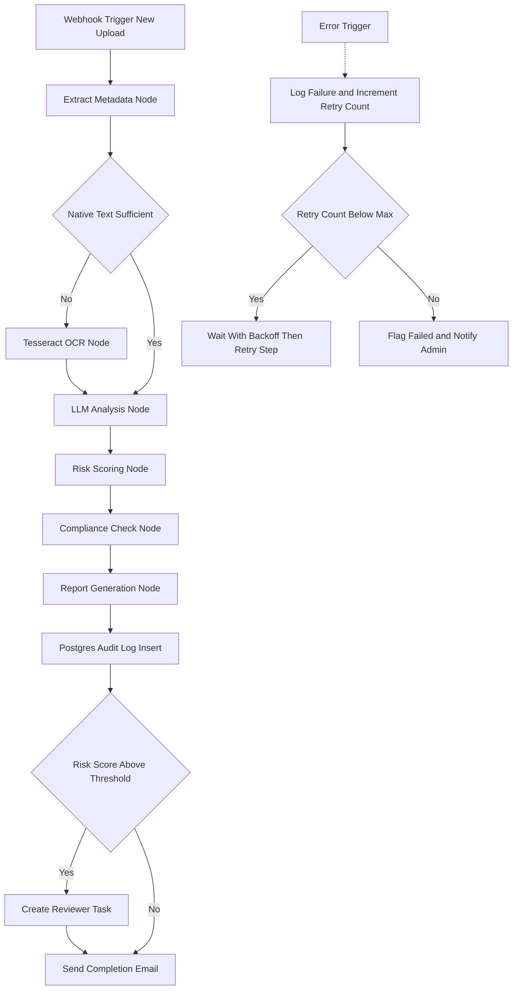

# Legal Analyzer App — Complete Architecture & Product Plan

> **Disclaimer:** This system assists legal review. It does not replace a licensed lawyer. All AI-generated risk flags, summaries, and compliance checks must be treated as first-pass triage, not legal advice, and should carry visible confidence indicators and a human-review path before any decision is made based on them.

---

## SECTION 1 — Product Definition

**What it does:** Legal Analyzer ingests contracts, NDAs, agreements, compliance documents, policies, and notices; extracts and cleans the text; identifies clauses; flags risky or unusual language; checks documents against configurable compliance rule sets; generates plain-English summaries and exportable reports; and keeps a searchable, audited history of everything reviewed.

**Target users:**
- Startup founders and small business owners without in-house counsel
- Freelancers/consultants reviewing service agreements before signing
- Small compliance/legal-ops teams doing first-pass document triage
- Law students and paralegals learning contract review
- Anyone who needs a fast "should I be worried about this clause" check before paying a lawyer for a full review

**Pain points solved:**
- Legal review is slow and expensive for routine documents
- Non-lawyers can't easily spot one-sided or missing clauses
- No lightweight triage step exists before escalating to paid legal counsel
- Manually comparing a document against standard templates is tedious and error-prone
- No searchable audit trail of what was reviewed, when, and what was flagged

**MVP goals:** single-user auth → upload → OCR/extract → chunk → LLM-based clause extraction, risk flagging, and summarization → basic exportable report → document history. Single jurisdiction focus recommended at first (pick one — see Section 6 on why this matters).

**Future advanced features:** multi-user organizations with RBAC, jurisdiction-aware compliance rule engine, legal citation/case-law grounding, clause library with redlining and negotiation suggestions, e-signature integration, multi-language support, human-reviewer marketplace, public API for embedding into other products.

---

## SECTION 2 — Core Features

| Feature | Purpose | User Type | MVP/Future | Complexity |
|---|---|---|---|---|
| User authentication | Secure access, session management | All | MVP | Low |
| Document upload & validation | Ingest files, reject unsafe/invalid types | All | MVP | Low |
| OCR / text extraction | Handle scanned and native-text documents | System | MVP | Medium |
| Preprocessing & chunking | Prepare text for LLM/embedding calls | System | MVP | Medium |
| Clause extraction | Identify key clauses (termination, liability, etc.) | All | MVP | High |
| Risk detection & scoring | Flag risky, one-sided, or missing clauses | All | MVP | High |
| Summarization | Plain-English overview of the document | All | MVP | Medium |
| Report generation | Exportable PDF/HTML report of findings | All | MVP | Medium |
| Document history | View past uploads and results | All | MVP | Low |
| Audit logs | Traceability of every action on a document | Admin | MVP | Medium |
| Automation workflows | Orchestrate the processing pipeline | System | MVP | Medium |
| Notifications | Alert user when analysis completes | All | MVP | Low |
| Compliance checks | Match document against a rule set | Org/Admin | Future | High |
| Legal citation / reference lookup | Ground flags in real statutes/case law | All | Future | High |
| Admin dashboard | Manage users, orgs, usage, logs | Admin | Future | Medium |
| Human-in-the-loop review | Manual approve/override of AI output | Reviewer | Future | Medium |

---

## SECTION 3 — End-to-End Workflow

**Narrative flow:** A user signs up, logs in, and lands on a dashboard. They upload a document, which is validated (file type, size, malware scan). The file is stored, and a background job begins: OCR/text extraction (with a fallback path for scanned documents), chunking, embedding, LLM-based clause extraction and risk scoring, an optional compliance check, and report generation. Results are saved to the database, the user is notified, and the document appears in their history with a full audit trail. High-risk documents can be routed to a human reviewer before the user sees a "final" result.

### 1. User Workflow Diagram

*User signs in, uploads a file, waits through validation and processing, then views results, downloads a report, asks follow-up questions, or browses history.*

### 2. Backend Processing Workflow Diagram

*The API layer accepts the upload and hands off to a queue. Workers run OCR, extraction, embedding, LLM analysis, risk scoring, and compliance checks in sequence. Results are persisted, logged, and the user is notified.*

### 3. Automation Workflow Diagram

*This is the automation-engine view (built in n8n — see Section 9): it decides whether OCR fallback is needed, runs AI analysis, checks risk thresholds, and escalates to a human reviewer only when necessary.*

---

## SECTION 4 — System Architecture

**Layers:**
- **Frontend:** Next.js — upload UI, results dashboard, PDF viewer with highlights
- **API/Backend:** FastAPI — auth, upload handling, orchestration triggers, REST endpoints
- **AI analysis layer:** embeddings + LLM calls for extraction, risk scoring, summarization
- **Legal research/data layer:** optional case-law/citation lookups (jurisdiction-dependent — see Section 6)
- **Database:** PostgreSQL (+ pgvector extension for embeddings)
- **Storage:** S3-compatible object storage for uploaded files and generated reports
- **Queue/background jobs:** Redis + a worker process (Celery/RQ) for anything slow (OCR, LLM calls)
- **Automation/orchestration:** n8n, coordinating the multi-step pipeline and retries
- **Monitoring/logging:** Sentry for errors, structured logs into the audit_logs table
- **Deployment:** Vercel (frontend) + Render/Railway (backend + workers)

### Architecture Diagram

**Request flow:** Frontend calls FastAPI, which handles auth, writes metadata to Postgres, stores the file, and enqueues a job — it responds immediately rather than blocking on processing.

**Async job flow:** Workers pull from the Redis queue, run OCR/LLM/risk-scoring steps in order, and write results back to Postgres. n8n can either *be* this orchestration layer or sit alongside it triggering/monitoring the pipeline via webhooks.

**Where caching helps:** embeddings for identical/near-identical clauses (avoid re-embedding boilerplate), LLM prompt caching for repeated system prompts, and cached compliance rule sets.

**Where rate limiting is needed:** the upload endpoint (prevent abuse), the LLM worker (respect provider free-tier limits), and any external legal-data API calls (most have strict free-tier caps).

**Replaceable components:** pgvector → dedicated vector DB (Qdrant) at scale; Tesseract → cloud OCR at scale; free-tier LLM → Claude API for quality; Render → containerized deployment (ECS/Kubernetes) at scale. Everything above the database is intentionally swappable — the schema and queue contract should stay stable while individual services change.

---

## SECTION 5 — Tech Stack (Free-First)

| Category | Tool | Why It Fits | Free/OSS Status | Pros | Cons | Alternative |
|---|---|---|---|---|---|---|
| Frontend | Next.js (React) | Fast DX, huge ecosystem, easy deploy to Vercel | OSS, free | Mature, great docs | Learning curve if new to React | SvelteKit |
| Backend | FastAPI (Python) | Async, auto-generated docs, pairs naturally with AI/ML libraries | OSS, free | Fast to build, typed | Python packaging can be fiddly | Node.js + Express |
| Database | PostgreSQL | Relational + supports pgvector in one place | OSS, free | Mature, one DB for structured + vector data | Needs index tuning at scale | MySQL (no native vector support) |
| Authentication | Supabase Auth | Free tier, integrates directly with Postgres | Free tier | Fast setup, social logins | Some vendor lock-in | Clerk, Auth.js/NextAuth |
| File storage | Supabase Storage / Cloudflare R2 | S3-compatible, generous free tier | Free tier | Simple SDKs | Egress limits on free tier | AWS S3 (paid) |
| OCR | Tesseract | Fully open-source, solid on typed/clean text | OSS, free | No cost, runs offline | Weak on messy scans/handwriting | PaddleOCR, EasyOCR |
| LLM integration | Claude API / Gemini free tier / Ollama (local) | Strong reasoning for legal text; free options exist at every tier | Free tier + paid | High-quality output (Claude), $0 option (Ollama) | Free tiers rate-limited; paid has real cost at scale | Local Llama 3.3 via Ollama |
| Vector database | pgvector (inside Postgres) | No extra service to run for an MVP | OSS, free | One database to manage | Less optimized than dedicated vector DBs at large scale | Qdrant Cloud free tier |
| Queue/background jobs | Redis + Celery (or RQ) | Standard, well-documented async job pattern | OSS, free (self-hosted) | Reliable, battle-tested | Requires a running worker process | n8n's internal queue mode |
| Automation | n8n (self-hosted) | Visual workflow builder, exactly matches the orchestration needs here | OSS, free self-hosted | No-code pipeline, easy to debug visually | Self-hosting adds ops work | Node-RED |
| Notification/email | Resend / SendGrid free tier | Simple transactional email APIs | Free tier | Quick integration | Daily send caps on free tier | Nodemailer + SMTP (dev only) |
| Deployment | Vercel (frontend) + Render (backend/workers) | Git-based deploys, free tiers | Free tier | Zero-config CI/CD | Cold starts/sleep on free tier | Railway, Fly.io |
| Monitoring | Sentry | Error tracking, easy setup | Free tier | Fast to wire in | Limited event volume on free tier | Self-hosted Grafana + Loki |
| Analytics | PostHog | Product analytics, open-source | Free tier / OSS self-host | Generous free event volume | Self-hosting adds complexity | Plausible |
| Admin dashboard | Custom Next.js admin route (or Retool free tier) | Reuses your own stack; no new vendor for MVP | Free | Full control | More build time than a low-code tool | Retool |

---

## SECTION 6 — API Recommendations

**Important context first:** legal data is fragmented by design — case law, statutes, and regulations live in different systems per jurisdiction, and no single API covers all three globally. Pick **one jurisdiction to focus on for your MVP** and treat the `legal_references` module as swappable per-region rather than assuming one universal source.

**1. OCR / document parsing APIs**
- **Tesseract** (self-hosted, free, open-source) — default choice for typed/clean scans
- **Google Cloud Vision OCR** — free tier (~1,000 units/month), better on messy scans; use as fallback when Tesseract confidence is low

**2. LLM / summarization APIs**
- **Claude API** — best reasoning quality for clause interpretation; new accounts get free credits, then usage-based pricing
- **Google Gemini API free tier** — no credit card, generous daily request limits; good default for MVP
- **Ollama (local models)** — fully free, runs offline; weaker reasoning but zero cost and useful for early development

**3. Legal research APIs (case law)**
- **CourtListener API (Free Law Project)** — covers U.S. federal and state case law, oral arguments, and judge data; offers a free membership tier (with a base rate limit) and a free **EDU membership** for students, which is a strong fit if this is a student project. This only covers **U.S.** jurisdictions.
- **Indian Kanoon API** — covers Indian case law (Supreme Court, High Courts, tribunals), but API access is token-based and generally requires applying for commercial/paid access rather than being freely open — factor this in if your target jurisdiction is India; a free MVP may need to start without live case-law grounding for this market and add it later once budget allows.

**4. Citation / reference lookup (statutes & regulations)**
- No clean universal free API exists here. For the U.S., **govinfo.gov (GPO)** publishes free bulk data/APIs for federal statutes and regulations, and **Cornell LII** offers free web access (but no robust public API). For India, **indiacode.nic.in** hosts central acts but lacks a public API — expect to curate a lightweight reference dataset manually for your MVP rather than relying on a live lookup.
- Design the `legal_references` table so it can be populated manually at first and swapped for a live API per-jurisdiction later without a schema change.

**5. Email/notification APIs**
- **Resend** — modern API, generous free tier
- **SendGrid** — free tier (~100 emails/day), well-documented

**6. Storage/upload APIs**
- **Supabase Storage** — S3-compatible, free tier, integrates with Supabase Auth/DB
- **Cloudflare R2** — 10GB free, no egress fees, good standalone option

---

## SECTION 7 — Database Schema

| Table | Key Columns | Purpose |
|---|---|---|
| `users` | `id` PK, `org_id` FK → organizations, `email`, `role`, `created_at` | Account records and role (user/admin/reviewer) |
| `organizations` | `id` PK, `name`, `plan` | Multi-tenant grouping for teams |
| `documents` | `id` PK, `user_id` FK → users, `filename`, `status`, `uploaded_at` | Uploaded file metadata and processing status |
| `extracted_text` | `id` PK, `document_id` FK → documents, `content`, `method` | Raw text pulled via native parsing or OCR |
| `clauses` | `id` PK, `document_id` FK → documents, `clause_type`, `clause_text` | Individually extracted clauses |
| `risk_flags` | `id` PK, `clause_id` FK → clauses, `severity`, `explanation` | Risk findings tied to a specific clause |
| `compliance_checks` | `id` PK, `document_id` FK → documents, `rule_set`, `result` | Results of matching against a compliance rule set |
| `legal_references` | `id` PK, `document_id` FK → documents, `source`, `citation` | Any statute/case-law citations attached to findings |
| `reports` | `id` PK, `document_id` FK → documents, `format`, `file_url` | Generated exportable reports |
| `notifications` | `id` PK, `user_id` FK → users, `type`, `read` | In-app/email notification records |
| `audit_logs` | `id` PK, `document_id` FK → documents, `action`, `created_at` | Full trace of every action taken on a document |
| `automation_runs` | `id` PK, `document_id` FK → documents, `workflow_name`, `status` | Tracks each automation execution for idempotency/retries |

**Relationships:** an organization has many users; a user has many documents; a document fans out into extracted text, clauses, compliance checks, references, reports, audit logs, and automation runs; a clause has many risk flags.

### ER Diagram

**Indexing suggestions:** index `documents.user_id`, `documents.status`; index `clauses.document_id`, `risk_flags.clause_id`; use a vector index (`ivfflat` or `hnsw`) on the embedding column in your pgvector table; index `audit_logs.document_id` + `created_at` together for fast timeline queries; index `automation_runs.document_id` + `workflow_name` as a composite unique key for idempotency (see Section 9).

---

## SECTION 8 — Module Design

**Auth module** — *In:* email/password or OAuth token · *Out:* session/JWT · *Logic:* Supabase Auth handles hashing, sessions, RBAC roles · *APIs:* Supabase Auth · *Failure:* invalid credentials, expired token · *Retry:* none (user re-authenticates)

**Upload module** — *In:* file + user_id · *Out:* document record + storage URL · *Logic:* validate MIME type, size limit, virus scan · *APIs:* Supabase Storage/R2 · *Failure:* oversized file, disallowed type, malware hit · *Retry:* client retries upload; no server-side retry needed

**OCR module** — *In:* stored file · *Out:* raw text · *Logic:* try native text layer first, fall back to Tesseract/Cloud Vision if extraction is thin · *APIs:* Tesseract, optional Cloud Vision · *Failure:* unreadable scan, corrupted file · *Retry:* 2 attempts, then flag for manual upload of a cleaner copy

**Parsing module** — *In:* raw text · *Out:* cleaned, chunked text · *Logic:* strip boilerplate, split into semantically coherent chunks (by section/paragraph) · *APIs:* none (local processing) · *Failure:* malformed text encoding · *Retry:* re-run with fallback encoding detection

**Clause analysis module** — *In:* text chunks · *Out:* labeled clauses · *Logic:* embed chunks, prompt LLM to classify clause type per chunk · *APIs:* embeddings API, LLM API · *Failure:* LLM timeout, malformed JSON response · *Retry:* 3 attempts with backoff; fall back to a smaller/cheaper model on repeated failure

**Risk analysis module** — *In:* labeled clauses · *Out:* risk_flags rows · *Logic:* LLM scores each clause against known risk patterns (one-sided termination, unlimited liability, auto-renewal traps, etc.) · *APIs:* LLM API · *Failure:* ambiguous clause, low-confidence output · *Retry:* re-prompt once with more context; otherwise mark "needs human review"

**Compliance module** *(Phase 2)* — *In:* document + selected rule set · *Out:* compliance_checks rows · *Logic:* compare clauses against a configurable rule set (e.g., data-retention requirements) · *APIs:* internal rule engine, optional external compliance data · *Failure:* rule set mismatch with document type · *Retry:* none — surfaces as "not applicable"

**Legal lookup module** *(Phase 2)* — *In:* flagged clause · *Out:* legal_references rows · *Logic:* query jurisdiction-appropriate source (e.g., CourtListener for U.S.) · *APIs:* CourtListener/Indian Kanoon/manual dataset · *Failure:* API rate limit, no matching reference found · *Retry:* queue for retry after rate-limit window; otherwise leave reference blank rather than guessing

**Reporting module** — *In:* all analysis results for a document · *Out:* PDF/HTML report · *Logic:* template-fill findings into a structured report · *APIs:* none (local rendering) · *Failure:* template rendering error · *Retry:* 1 retry, then notify admin

**Automation module** — *In:* new document event · *Out:* orchestrated pipeline execution · *Logic:* n8n workflow sequencing each step above · *APIs:* internal webhooks · *Failure:* any step failure · *Retry:* per-step retry with backoff, escalate after max attempts (see Section 9)

**Notification module** — *In:* completed/failed job event · *Out:* email/in-app notification · *Logic:* template + send · *APIs:* Resend/SendGrid · *Failure:* send failure, invalid email · *Retry:* 2 attempts, then log as undelivered

**Admin module** *(Phase 2/3)* — *In:* admin actions · *Out:* user/org management changes, usage views · *Logic:* CRUD over users/orgs, view audit logs and automation run health · *APIs:* internal only · *Failure:* unauthorized access attempt · *Retry:* n/a — logged as a security event

---

## SECTION 9 — Automation Design (n8n)

**Plan:** trigger on new upload → extract metadata → OCR fallback check → AI processing → risk scoring → compliance check → report creation → notification → audit log update → retry queue for failures → human-review escalation for high-risk documents.

### Automation Flow (detailed)

### n8n workflow breakdown, node by node
1. **Webhook node** — receives the "new document uploaded" event from the backend
2. **Set/Function node** — extracts metadata (file type, size, page count)
3. **IF node** — checks whether native-extracted text length/quality passes a threshold
4. **HTTP Request node (OCR)** — calls Tesseract service only if the IF node says "no"
5. **HTTP Request node (LLM)** — sends chunked text to the LLM API for clause extraction/summarization
6. **Function node (Risk Scoring)** — applies scoring logic to LLM output
7. **HTTP Request/Function node (Compliance)** — checks against selected rule set
8. **Function/HTML node (Report)** — renders findings into a report template
9. **Postgres node** — writes results and an audit_logs row
10. **IF node (Review Threshold)** — routes to a reviewer task if risk score is high
11. **Email node** — sends the completion notification
12. **Error Workflow** (separate n8n workflow attached via Error Trigger) — catches any node failure, logs it, and manages retries

**Error handling strategy:** attach a dedicated Error Workflow to the main workflow; on failure, log the error with document_id and step name, increment a retry counter stored in `automation_runs`, and use a Wait node for exponential backoff (e.g., 30s, 2m, 10m) before retrying the failed step only — not the whole pipeline.

**Idempotency strategy:** use a composite key of `document_id + workflow_name` (or `document_id + step_name`) in `automation_runs`; before executing a step, check whether it's already marked complete for that document so redelivered webhooks or retried queue messages don't double-process a document.

**Logging strategy:** every node writes a structured entry (document_id, step, status, timestamp, duration) to `audit_logs`; use n8n's built-in execution history for step-level debugging during development, and treat Postgres as the durable source of truth for anything the user or admin needs to see later.

---

## SECTION 10 — Security and Legal Safety

**Security requirements:**
- Authentication via Supabase Auth (or equivalent), with hashed credentials and session tokens
- Authorization/RBAC: user, reviewer, and admin roles with scoped permissions
- Signed, time-limited URLs for any direct file access (never public buckets)
- Encryption in transit (TLS everywhere) and at rest (provider-managed encryption on storage/DB)
- Secure file upload handling: strict MIME-type allowlist, size caps, and malware/antivirus scanning before processing
- Audit trails for every document action (upload, view, export, delete)
- API keys and secrets stored in environment variables/secret managers, never in code or client bundles
- Rate limiting on upload and on all LLM/external API calls
- A defined data retention policy (e.g., auto-delete uploaded files after N days unless the user opts to keep them)
- PII handling: minimize what's logged, redact sensitive fields in logs, and give users a way to delete their data
- Prompt-injection defense: treat uploaded document text as untrusted input — never let instructions embedded inside a document alter system-level prompts or trigger unintended tool calls
- Secure logging: no raw document content in application logs; log references (document_id), not content

**Legal precautions:**
- Prominent "not legal advice" disclaimer on every report and results screen
- Explicit prompt for human verification before any high-stakes action is taken based on output
- Clear statement of jurisdiction limitations (e.g., "analysis calibrated for [jurisdiction] law only")
- Visible confidence scores on every AI-generated flag or summary
- Explainability: every risk flag links back to the exact clause/source text it came from, and to any legal reference used

---

## SECTION 11 — Deployment Plan

| Layer | Free/Low-Cost Choice |
|---|---|
| Frontend hosting | Vercel (Hobby tier) |
| Backend hosting | Render or Railway free/starter tier |
| DB/Storage hosting | Supabase free tier (Postgres + pgvector + Storage + Auth in one) |
| Automation hosting | n8n self-hosted via Docker on a free-tier VM (e.g., Oracle Cloud Always-Free) or Render free instance |
| Environment variables | Managed via each platform's built-in secrets manager |
| CI/CD | GitHub Actions (free for public/small private repos) |
| Observability | Sentry free tier for errors, Postgres-based audit logs for business events |
| Backups | Supabase automated backups (paid tiers) or manual scheduled `pg_dump` on free tier |

**Recommended MVP deployment stack:** Vercel (frontend) + Render (FastAPI backend + worker) + Supabase (Postgres/pgvector/Storage/Auth) + n8n self-hosted on a free VM + GitHub Actions + Sentry. This combination is genuinely $0 to run at student-project scale.

---

## SECTION 12 — Roadmap

**Phase 1 — MVP (4–6 weeks, solo)**
- Deliverables: auth, upload, OCR, chunking, LLM clause extraction + risk flagging + summarization, basic report export, document history
- Technical goals: working end-to-end pipeline on the free-tier stack
- Team: solo student developer

**Phase 2 — Better Analysis (+3–4 weeks)**
- Deliverables: compliance checks (single rule set), legal reference lookup for one jurisdiction, improved risk scoring, polished PDF reports, audit logs
- Technical goals: introduce the compliance and legal-lookup modules; tighten prompt design
- Team: solo, or +1 collaborator for frontend polish

**Phase 3 — Automation & Collaboration (+4–6 weeks)**
- Deliverables: full n8n automation with retries/escalation, notifications, human-in-the-loop review, admin dashboard, multi-user organizations
- Technical goals: idempotent, observable automation pipeline; RBAC
- Team: 2 developers (backend-leaning + frontend-leaning)

**Phase 4 — Startup-Grade Scaling (3–6+ months)**
- Deliverables: dedicated vector DB, paid LLM tier with prompt caching, containerized deployment, formal SLAs, security hardening (pen-testing, SOC2-lite practices)
- Technical goals: move off free tiers where they become bottlenecks; introduce proper observability (metrics + tracing)
- Team: dedicated small team (backend, frontend, and ideally a part-time legal SME for rule-set accuracy)

---

## SECTION 13 — Final Recommendation

**1. Lowest-cost stack:** Next.js + FastAPI + Supabase (Postgres/pgvector/Storage/Auth) + Tesseract + Gemini free tier or local Ollama + n8n self-hosted + Vercel/Render free tiers. Realistic cost: **$0**.

**2. Fastest-development stack:** Next.js + Supabase (all-in-one auth/db/storage) + Claude API (less prompt-tuning needed for good output) + a hosted OCR/parsing API instead of building OCR fallback logic yourself. Slightly higher cost, noticeably less build time.

**3. Long-term scalability stack:** Next.js + containerized FastAPI (ECS/Kubernetes) + managed Postgres (RDS) + dedicated vector DB (Qdrant) + Claude API with prompt caching + a proper Celery/Redis cluster + n8n Cloud or self-hosted HA + full observability stack (Grafana/Loki/Sentry).

**4. My recommendation for a B.Tech student MVP:** go with the **lowest-cost stack**. It's genuinely $0, every tool in it (Next.js, FastAPI, Postgres, n8n) is currently in high demand and résumé-relevant, and because nothing is abstracted away by a paid managed service, you'll actually learn every layer — OCR, embeddings, RAG, risk scoring, and workflow automation — rather than just wiring together black boxes. Upgrade individual pieces (LLM quality, vector DB, hosting) only once the free tier becomes an actual bottleneck, not before.

---

## Build Order Checklist

1. Set up repo, Next.js frontend, FastAPI backend skeleton, Supabase project
2. Implement auth (signup/login) end to end
3. Build upload endpoint + file validation + Supabase Storage integration
4. Add OCR/text extraction with Tesseract, including the "is this text good enough" check
5. Implement chunking + embeddings + pgvector storage
6. Wire up LLM calls for clause extraction, risk scoring, and summarization (structured JSON output)
7. Build the results dashboard + PDF viewer with highlights
8. Add report generation (PDF/HTML export)
9. Add document history + audit logging
10. Stand up n8n, rebuild the pipeline above as an automation workflow with retries
11. Add notifications (email on completion)
12. Add compliance checks + legal reference lookup for your chosen jurisdiction
13. Add admin dashboard, RBAC, and human-review escalation
14. Deploy: Vercel + Render + Supabase + n8n on a free VM; wire up GitHub Actions + Sentry
15. Test with real sample contracts/NDAs, tighten prompts based on failure cases, ship
